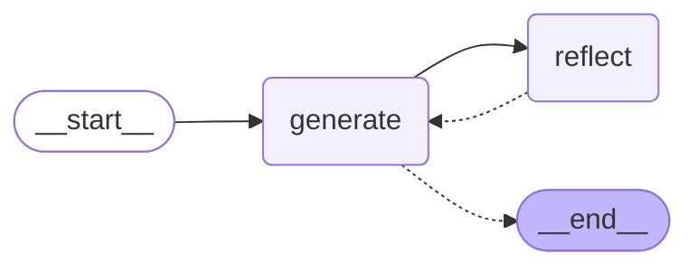

# 🦜🪞 LangGraph Reflection Agent

This repository contains a reflection-style agent architecture built with LangGraph that improves output quality through self-critique and refinement.

## ✨ Overview

The reflection agent uses a feedback loop between a generation component and a reflection component to iteratively improve responses to user queries. In this implementation, we've created a Twitter assistant that enhances tweets through multiple rounds of critique and revision.

## 🔄 How It Works

1. **Generate**: The initial component creates a response (in our case, a tweet) based on the user's input
2. **Reflect**: The reflection component evaluates the generated content and provides specific feedback for improvement
3. **Loop**: The generation component refines its output based on the reflection's feedback
4. **Termination**: The process ends after a predetermined number of iterations (currently set to 6)

This approach creates a self-improving system that produces higher quality outputs through deliberate reflection.

## 🛠️ Implementation Details

### Main Components

The reflection agent is built with two primary nodes:

1. **Generation Node** (in `chains.py`):
   - Uses a specialized prompt for creating Twitter content
   - Responds to critique by refining previously generated content

2. **Reflection Node** (in `chains.py`):
   - Critiques the generated content against quality criteria
   - Provides specific recommendations for improvement
